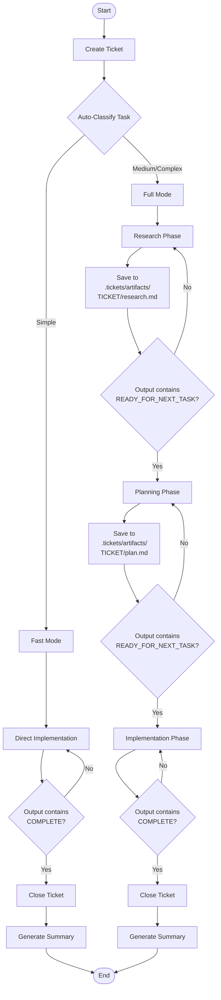

# Basic Ralph

Basic Ralph is a simple, Python-based research-plan-implement loop for building the Ralph Loop - an AI-assisted software development workflow.

## Overview

Basic Ralph implements a three-phase workflow for AI-assisted software development as part of "Frequent Intentional Context Compaction":

1. **Research** - Analyze the task and document findings
2. **Planning** - Create an implementation plan based on research
3. **Implementation** - Execute the plan to complete the task

## Workflow



## Installation

No installation required, uses only stdlib.
Requires Python 3.9+.

## Usage

### The Ralph Loop - Run Command

Execute the research-plan-implement workflow with automatic task complexity classification:

```bash
# Basic usage - auto-classifies and optimizes workflow
python basic_ralph.py run "Implement user authentication"

# With options
python basic_ralph.py run "Refactor database layer" \
    --model kimi-k2.5-free \
    --max-iterations 5 \
    --completion-promise "DONE"

# From file
python basic_ralph.py run --prompt-file task.txt

# Multiple tasks
python basic_ralph.py run -f task1.txt -f task2.txt "Third task"

# Force fast mode (skip research/planning)
python basic_ralph.py run "Quick fix" --fast

# Force full workflow (always do research/planning)
python basic_ralph.py run "Complex feature" --full
```

**Auto-Classification:** By default, Basic Ralph automatically classifies tasks as:
- **Simple** - Single file changes, typo fixes, renames (< 20 lines). Skips research/planning.
- **Medium** - Multiple files, some research needed. Uses full workflow.
- **Complex** - New architecture, significant research. Uses full workflow with extra care.

### Ticket Management

Basic Ralph includes a full ticket management system with dependencies.

```bash
# Create tickets
python basic_ralph.py ticket create "Fix login bug" -d "Users can't log in"
python basic_ralph.py ticket create "Add feature" -p 1 --type feature

# Manage status
python basic_ralph.py ticket start abc-1234      # Mark as in_progress
python basic_ralph.py ticket close abc-1234      # Mark as closed
python basic_ralph.py ticket reopen abc-1234     # Mark as open

# List tickets
python basic_ralph.py ticket ls                    # List all tickets
python basic_ralph.py ticket ready                 # Show unblocked tickets
python basic_ralph.py ticket blocked               # Show blocked tickets
python basic_ralph.py ticket show abc-1234         # View ticket details

# Dependencies
python basic_ralph.py ticket dep abc-1234 def-5678     # Add dependency
python basic_ralph.py ticket undep abc-1234 def-5678   # Remove dependency
python basic_ralph.py ticket dep-tree abc-1234         # Show dependency tree

# Links (symmetric relationships)
python basic_ralph.py ticket link ticket1 ticket2 ticket3
python basic_ralph.py ticket unlink abc-1234 def-5678

# Other commands
python basic_ralph.py ticket edit abc-1234         # Open in editor
python basic_ralph.py ticket add-note abc-1234 "Progress update"
python basic_ralph.py ticket query                 # Output as JSON
python basic_ralph.py ticket closed --limit 10     # Recent closed tickets
```

### Ticket File Format

Tickets are stored as Markdown files in `.tickets/` with TOML frontmatter:

```markdown
+++
id = "proj-a1b2"
status = "open"
deps = ["other-ticket"]
links = []
created = "2024-01-15T10:00:00Z"
type = "task"
priority = 2
complexity = "medium"
+++
# Ticket Title

Description here...

## Design

Design notes...

## Acceptance Criteria

- Criterion 1
- Criterion 2

## Notes

**2024-01-15T10:30:00Z**

Progress update...
```

### Command Options

**Run Command:**

- `--min-iterations N` - Minimum iterations before completion (default: 1)
- `--max-iterations N` - Stop after N iterations (default: unlimited)
- `--completion-promise TEXT` - Text signal for completion (default: COMPLETE)
- `--abort-promise TEXT` - Text signal for early abort
- `--task-promise TEXT` - Text signal for phase completion (default: READY_FOR_NEXT_TASK)
- `--model MODEL` - Model to use (e.g., kimi-k2.5-free)
- `--rotation MODEL1,MODEL2` - Rotate models each iteration
- `--prompt-file FILE` - Read task from file (can use multiple)
- `--fast` - Force skip research/planning
- `--full` - Force full workflow with research/planning

**Ticket Create:**

- `-d, --description` - Description text
- `--design` - Design notes
- `--acceptance` - Acceptance criteria
- `-p, --priority` - Priority 0-4 (0=highest, default: 2)
- `-t, --type` - Type: bug, feature, task, epic, chore (default: task)
- `-a, --assignee` - Assignee name
- `--external-ref` - External reference (e.g., gh-123, JIRA-456)
- `--parent` - Parent ticket ID

## Artifacts

When running tasks, artifacts are saved to `.tickets/artifacts/<ticket_id>/`:

- `research.md` - Research findings
- `plan.md` - Implementation plan
- `summary.md` - Task execution summary

## Dependencies

- Python 3.9+ (uses only stdlib)
- opencode CLI (for the run command)

## Examples

```bash
# Run a task with the free model
python basic_ralph.py run "Write tests for utils.py" --model kimi-k2.5-free

# Create a high-priority bug ticket
python basic_ralph.py ticket create "Critical bug" -p 0 --type bug

# Create a feature with design notes
python basic_ralph.py ticket create "New API endpoint" \
    -d "Add POST /api/users endpoint" \
    --design "Use FastAPI, validate with Pydantic" \
    --acceptance "- Returns 201 on success\n- Returns 400 on validation error" \
    -p 1 --type feature

# Execute a task from a file
python basic_ralph.py run --prompt-file feature-spec.txt --max-iterations 3

# Link related tickets
python basic_ralph.py ticket link ticket1 ticket2 ticket3
```

## Programmatic API

Basic Ralph can be imported and used programmatically:

```python
from basic_ralph import (
    create_ticket,
    update_ticket_status,
    add_note_to_ticket,
    get_ticket_info,
    list_all_tickets,
    execute_task,
)

# Create a ticket
ticket_id = create_ticket(
    title="New feature",
    description="Implement feature X",
    priority=1,
    issue_type="feature"
)

# Execute a task
success = execute_task(
    task_description="Implement feature X",
    ticket_id=ticket_id,
    model="kimi-k2.5-free"
)

# Update status
update_ticket_status(ticket_id, "closed")
```
